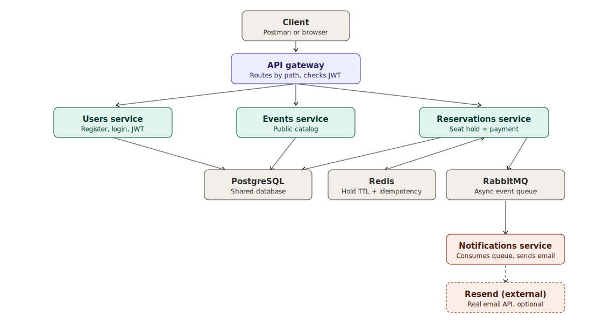

# Ticketing Platform — Phase 4 (The Bow)

The last phase: structured JSON logging across all 5 services, a full
architecture diagram, and a Postman collection that's been kept current
since Phase 1. No new features — this phase is about making the system
you already built legible to someone who didn't build it.



## Structured logging

Every service now logs JSON, not colored console text. This uses
[`nestjs-pino`](https://github.com/iamolegga/nestjs-pino) in the four
NestJS services, and a small hand-rolled JSON logger in the Gateway
(which is plain Express — pulling in pino for one access-log line per
request isn't worth a new dependency there).

**The key design goal was minimal churn**: every service already had
`new Logger(ClassName.name)` calls scattered across ~15 files
(`ReservationLockService`, `HttpExceptionFilter`, and so on). None of
those files changed. Wiring `LoggerModule.forRoot()` into `app.module.ts`
and `app.useLogger(app.get(Logger))` into `main.ts` is enough — Nest's
`Logger` class delegates its actual output to whatever the app-wide
logger is configured to be, so every existing call site gets structured
JSON for free.

```json
{"level":30,"time":1784713913635,"pid":4273,"hostname":"vm","req":{"id":"ebc7c304-872d-4ef2-8238-cc8dfdf2e740","method":"POST","url":"/reservations/37364e5e.../confirm","headers":{"authorization":"[Redacted]", "...": "..."}},"res":{"statusCode":201},"responseTime":17,"msg":"request completed"}
```

**Two things worth calling out specifically:**

1. **Request-id correlation across services.** The Gateway generates an
   `x-request-id` (or reuses one the client already sent) and forwards it
   downstream. Each backend service's `pinoHttp.genReqId` picks that same
   id up from the header instead of generating its own. The result:
   `grep` any request id across all 5 services' logs and you get the
   complete cross-service story of that one request — confirmed by
   actually doing exactly that during testing, not just written and
   assumed to work.

2. **Redaction.** `redact: ['req.headers.authorization']` in every
   service's `pinoHttp` config means a JWT never lands in aggregated
   logs, even though pino-http's automatic request logging captures
   headers by default. Verified: the header shows up as literally
   `"[Redacted]"` in every service's logs, every time.

**notifications-service** gets the same `LoggerModule.forRoot()` treatment
but without `pinoHttp` — it never receives an HTTP request (see Phase 3),
so there's nothing for pino-http's request-logging middleware to attach
to. It still gets structured JSON for every existing manual `Logger` call
(`NotificationsController`, `ConsoleEmailProvider`), confirmed working
even in a pure `createMicroservice()` context.

## Architecture diagram

`docs/architecture.svg` — self-contained (no dependency on any
external stylesheet, so it renders correctly wherever you view this
README) and respects your OS's light/dark mode automatically.

## Postman collection

`postman/ticketing.postman_collection.json` has been kept up to date
every phase rather than built fresh now — it already covers the full
flow through Phase 3's `/confirm` endpoint with `Idempotency-Key`.
Nothing new needed for Phase 4.

## Running it

Same as Phase 3 — nothing about `docker compose up --build` changed.
Watch any service's logs to see the new format:

```bash
docker compose logs -f reservations-service
```

Make a request through the Gateway, copy the `x-request-id` from the
response headers, and grep for it across every service to see the same
request's footprint end to end:

```bash
docker compose logs | grep "the-request-id-you-copied"
```

## The full picture

Four phases, one `main` branch, no `phase1/`, `phase2/` folders —
progress lives in Git tags and GitHub Releases instead (see
`CHANGELOG.md` for the same story in prose). What started as a single
NestJS process became:

- An API Gateway that's the only thing a client ever talks to.
- Three independently deployable HTTP services, two of which verify JWTs
  statelessly with zero database lookups.
- A Redis-backed 5-minute seat hold with two independent release
  mechanisms (reactive pub/sub + a backup sweep), both verified against
  real failure scenarios, not just the happy path.
- Stripe-style idempotency on the payment-confirming endpoint, verified
  against real concurrent requests.
- A fully async notifications service — zero HTTP surface, real email
  delivery confirmed against a live Resend account.
- Structured, correlated JSON logs across all five processes.

## Project roadmap

This repository evolves on a single `main` branch. Each completed phase is
marked with a Git tag and a matching GitHub Release — check the
**Releases** page to browse the code as it stood at the end of each phase.
